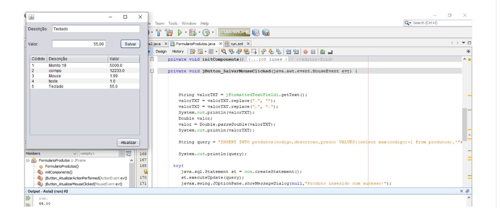
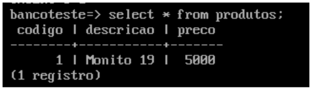

# Java-CentOS-PostgresSQL

Projeto utilizando o sistema operacional Linux CentOS, banco de dados PostgresSQL e a linguagem de programação JAVA aonde foi necessário subir a VM instalar o banco de dados, conforme descrito na documentação: <a href="https://github.com/PatrickCavalcant/java-centOS-postgresSQL/blob/main/T%C3%B3picos%20Especiais%20em%20Banco%20de%20Dados.pdf"><h4>Tópicos Especiais em Banco de Dados.pdf</h4></a>

<h4>Interface Gráfica - CRUD em Java</h4>

<h4>Banco de Dados (PostgresSQL) -  Consulta</h4>

